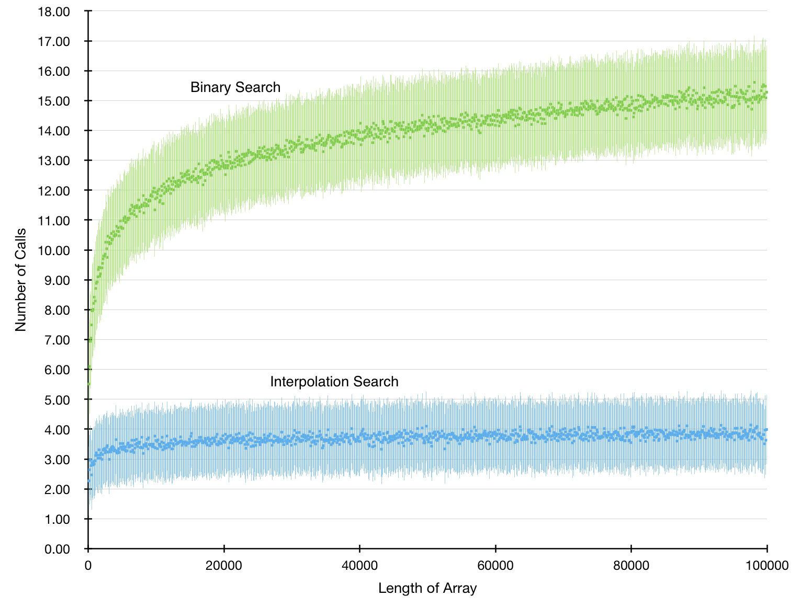

# ALP III - Übung 5 - Gruppe 1.8
Tobias Lohse, Marvin Kleinert, Anton Drewing <br>
Tutor: Marcel Erhardt, Mi 10-12

## Aufgabe 1
### (a)
```java
import java.util.*;
import java.io.*;

public class a1 {
  static Random rnd = new Random();
  static double calls = 0;

  static int binSearch(int[] arr, int key) {
    calls = 0;
    return binSearch(arr, key, 0, arr.length-1 );
  }
  static int binSearch(int[] arr, int key, int l, int r) {
    calls ++;
    if ( l>r )
      throw new RuntimeException("key not in array");
    int m = l+(r-l)/2;
    // System.out.println("l: "+l+"\tr: "+r+"\tm: "+m);
    if ( key==arr[m] )
      return arr[m];
    else if ( key<arr[m] )
      return binSearch(arr, key, l, m-1);
    else
      return binSearch(arr, key, m+1, r);
  }


  static int intplSearch(int[] arr, int key) {
    calls = 0;
    return intplSearch(arr, key, 0, arr.length-1 );
  }
  static int intplSearch(int[] arr, int key, int l, int r) {
    calls ++;
    if ( l>r )
      throw new RuntimeException("key not in array");
    int m = l+(int)(((double)key-arr[l])/(arr[r]-arr[l])*(r-l));
    // System.out.println("l: "+l+"\tr: "+r+"\tm: "+m);
    if ( key==arr[m] )
      return arr[m];
    else if ( key<arr[m] )
      return intplSearch(arr, key, l, m-1);
    else
      return intplSearch(arr, key, m+1, r);
  }


  static int[] newArray(int len, int range){
    int[] arr = new int[len];
    for ( int i=0; i<len ; i++ )
      arr[i] = rnd.nextInt(range);
    Arrays.sort(arr);
    return arr;
  }
  static double median(double[] arr) {
    double out = 0;
    for ( double i : arr ) {
      out += i;
    }
    return out/arr.length;
  }
  static double stdev(double[] arr) {
    double out = 0;
    double m = median(arr);
    for ( double i : arr ) {
      out += Math.pow(i-m,2);
    }
    return Math.sqrt(out/arr.length);
  }


  public static void main(String[] args) {
    try {
      PrintWriter writer = new PrintWriter("a1.csv", "UTF-8");
      int range;
      int found;
      int iterations = 100;
      writer.println("len, median BS, stdev BS, median IS, stdev IS");
      for ( int len=100; len<100000; len+=100 ) {
        range = len;
        System.out.print(len+", ");
        int i = 0;
        double[] callsBS = new double[iterations];
        double[] callsIS = new double[iterations];
        while ( i<iterations ) {
          int[] arr = newArray(len, range);
          int key = rnd.nextInt(range);
          try {
            binSearch(arr, key);
            callsBS[i] = calls;
            intplSearch(arr, key);
            callsIS[i] = calls;
            i++;
          } catch( RuntimeException e ){};
        }
        writer.println(len+","+median(callsBS)+","+stdev(callsBS)
                       +","+median(callsIS)+","+stdev(callsIS));
      }
      writer.close();
    } catch( Exception e ) {
      System.out.println("File Error");
    }
  }
}
```

Im folgenden Diagramm sind die über 100 Iterationen gemittelten Werte für die Anzahl der rekursiven Aufrufe für Array Längen von 100 bis 100,000 mit ihrer Standardabweichung eingetragen. Man kann gut erkennen, dass die Interpolations Suche in O(log log n) liegt und die Binärsuche in O(log n)

<br><br><br>

### (b)

Wenn wir im Array `[1, 1, 1, 1, 1, 1, 1, 1, 2, 99]` nach `2` suchen, so ergibt sich für `l` zwischen `0` und `7` folgendes:

`m = (key-arr[l])/(arr[r]-arr[l])*(r-l) ≤ (2-1)/(99-1)*(9-7) ≈ 0.01`

Somit ergibt sich also immer `m=l` und wir verkleineren in jedem Druchlauf das Array nur um eins. Damit ergeben sich `(n-1) = 9` rekursive Aufrufe, bis wir die `2` gefunden haben. Die Laufzeit liegt also in Θ(n), da die obere und untere Schranke gleich der Funktion `(n-1)` in O(n) ist.

Für solche Datenmengen mit ungleicher Dichte in verschiedenen Wertebereichen, in denen man nach einem Element am Rand des Bereichs mit großer Dichte sucht, ist Insertion Sort daher weniger geeignet.

## Aufgabe 2
```java
finde(k) -> Node:
  p = head
  while p.unten != null:
    while k >= p.rechts.key:
      p = p.rechts
    p = p.unter
  return p
```
```java
einfüge(k,d) -> void:
  fügein = [false] * height
  i = 0
  while münzwurf:
    fügein[i] = true
    i++
  p = head
  i = 0
  while p.unter != null:
    while k >= p.rechts.key:
        p = p.rechts
    if fügein[i]:
      p.next = p.next.next
      p.next = new Node(k,d)
      i++
    p = p.unter
```
```java
lösche(k) -> void:
  p = head
  i = 0
  while p.unter != null:
    while k >= p.rechts.key:
        p = p.rechts
    if key == p.next.key:
      p.next = p.next.next
    p = p.unter
```

## Aufgabe 3

### (a)
Um die Balancierung des Baumes zu gewährleisten, wenn es viele Elemente mit gleichem Schlüssel gibt. Ansonten würden wir die Balancierung verlieren und die Operationen könnten nicht mehr in O(log n) ausgeführt werden.


### (b)
```java
findeAlle(k, node=root, out=[]) -> Node[]:
    if node == nil:
        return out
    else:
        if k == node.key:
            out += node
            if k == node.right.key:
                return findAlle(k, node.right, out)
            if k == node.left.key:
                return findAlle(k, node.left, out)
        elif k < node.key:
            return findAlle(k, node.left, out)
        elif k > node.key:
            return findAlle(k, node.right, out)
```
Die Laufzeit für diesen Algorithmus liegt in O(h+s), da wir zunächst mit einer Suche auf einem normalen Binärbaum in O(h) das erste Element mit Schlüssel `k` finden. Wir wissen dann, dass alle weiteren Elemente mit Schlüssel `k` nur aus einer Linie direkter Nachkommen dieses ersten Elements stammen können. Also müssen wir maximal 2s Vergleiche durchführen, um sicher zu stellen, dass wir keine weiteren Elemente mehr finden können.


